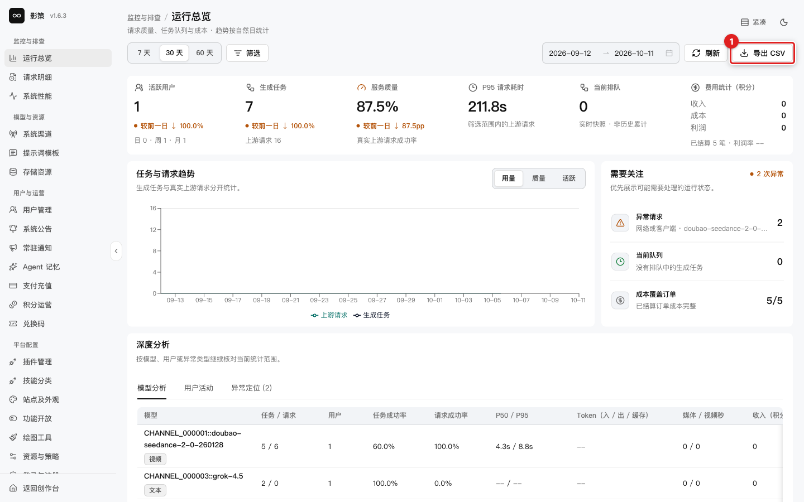

# 快速上手

## 你将学会

用只读方式完成一次管理员巡检：确认运行指标、查看失败请求、检查系统性能，并知道哪些操作需要单独授权。

## 前置条件

- 使用具有管理员权限的账号登录。
- 已确认当前环境是开发、预发布还是生产环境。
- 只读巡检可以直接进行；涉及保存、发布、删除、额度、凭据或更新的动作，先走团队变更流程。

## 完成一次巡检

1. 打开 `/admin`，确认页面标题为 **运行总览**。
2. 选择 **7 天**、**30 天**或 **60 天**，观察趋势和当前排队。需要外部分析时，可点击 **导出 CSV**；导出前确认当前日期范围和筛选条件。

   

3. 打开 **请求明细**，筛选失败或排障相关请求，点击一条记录查看详情。记录请求 ID、阶段、模型、渠道和错误摘要；不要把包含敏感信息的请求正文复制到公共工单。
4. 打开 **系统性能**，检查进程堆内存、数据磁盘、数据库连接和 Redis 状态。页面上的主机名、PID 和提交哈希只在受控环境内使用。
5. 如果失败请求与视频生成有关，先确认任务是否仍在队列或上游执行，再检查[资源与策略](10-tasks/configure-runtime-policy.md)中的任务超时。后台任务超时与浏览器等待超时是两层不同设置。

## 成功判据

- 你能说出当前时间范围、排队数量和服务质量。
- 你能从请求明细找到失败阶段和错误摘要。
- 你没有因为看到前端超时就立即重复提交生成任务。

## 取消、恢复与权限边界

- 导出 CSV 前可以改变筛选条件；导出本身不会修改业务数据。
- 请求详情抽屉可以直接关闭。**恢复任务**属于写操作，执行前先确认任务身份和是否会重复扣费。
- **刷新状态**只重新读取服务端状态；**保存修改**、**清理运行时缓存**和任何发布/删除按钮都应按变更流程执行。
