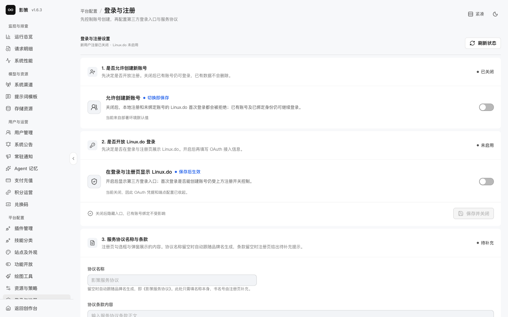
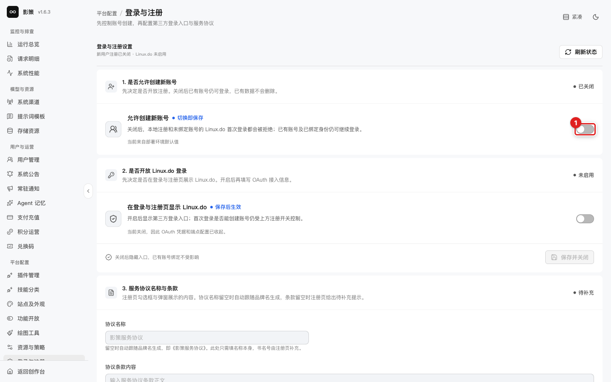
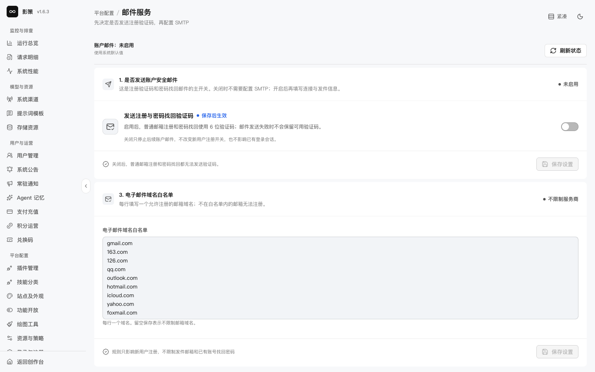

# 配置登录、注册和邮件服务

## 适用角色

账户与平台配置管理员。

## 目标

控制新账号入口、第三方登录、服务协议和验证码邮件，避免保存后出现无法注册或找回密码的情况。

## 1. 登录与注册

进入 `/admin/settings/access`。页面依次显示是否允许创建新账号、是否开放 Linux.do 登录、服务协议名称与条款。当前开发环境注册已关闭、Linux.do 未启用，协议状态为待补充。

切换注册开关前，确认已有账号仍可登录且新用户引导已准备好。开启 Linux.do 后再填写 OAuth 接入信息；关闭入口不会解除已有账号绑定。

协议名称留空时会跟随品牌名生成，条款留空时注册页显示待补充提示。保存协议后注册页立即生效，无需重启服务；发布前应在退出登录的隔离浏览器中验证。

## 2. 邮件服务

打开 `/admin/settings/email`。先决定是否发送注册和密码找回验证码，再填写 SMTP 配置和电子邮件域名白名单。

关闭账户邮件会导致普通邮箱注册和密码找回无法发送验证码；白名单只影响新用户注册，不影响已有账号找回密码。不要在截图或日志中暴露 SMTP 密码。

## 成功判据

- 能解释注册开关、第三方登录开关、服务协议和邮件服务的依赖顺序。
- 邮件关闭时不会承诺普通邮箱注册或找回密码可用。
- 新配置已在隔离账号上验证注册、登录和找回流程。

## 取消、恢复与风险边界

无变更时 **保存并关闭**、**保存服务协议**可能处于禁用状态。凭据填写和开关保存属于真实写入，本轮没有执行；只读查看不能证明 SMTP 或 OAuth 已经可用。
