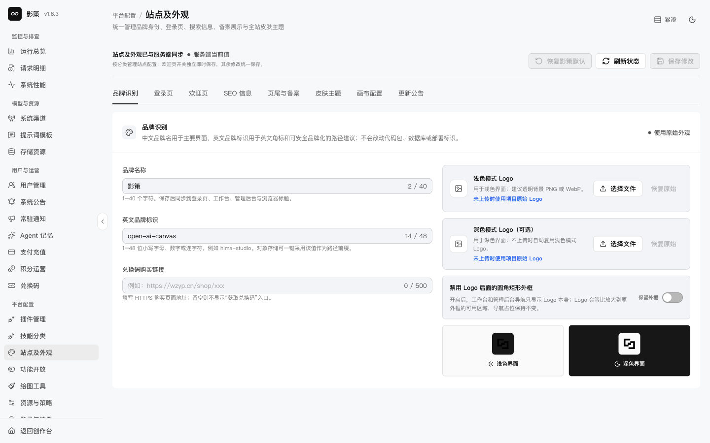
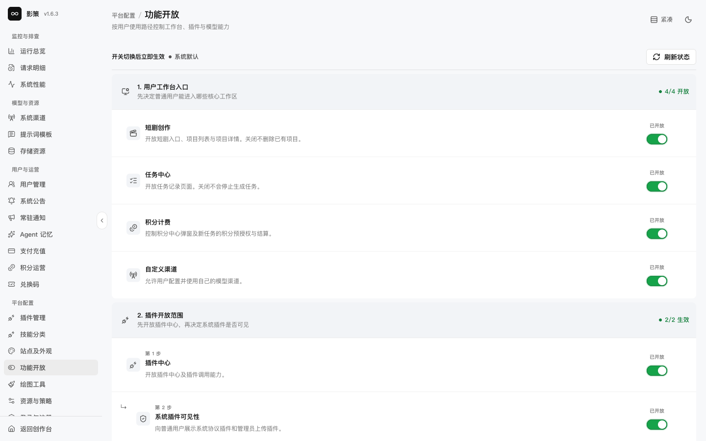
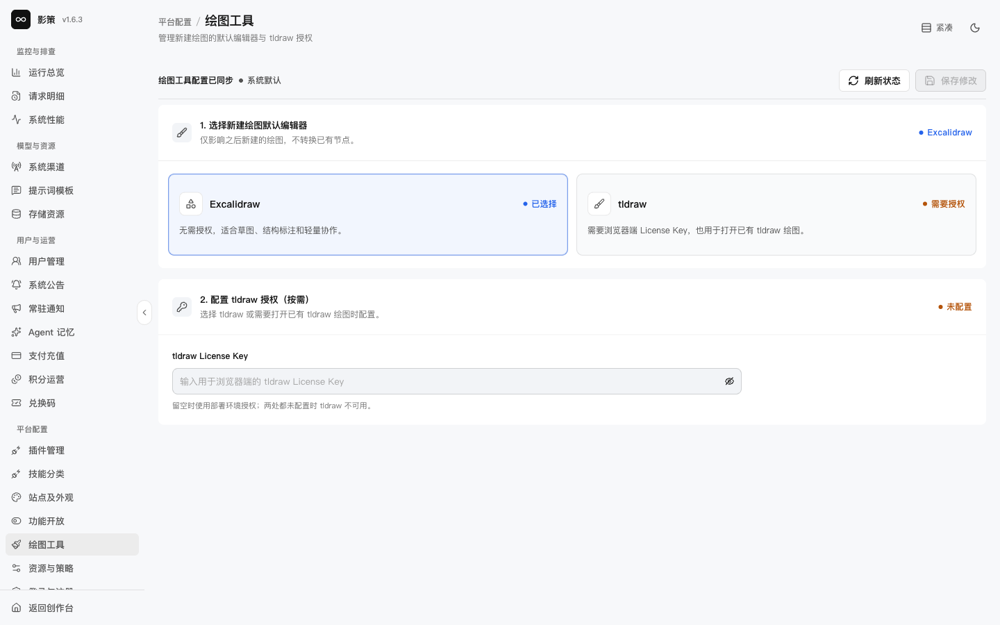

# 配置站点外观、功能和绘图工具

## 适用角色

产品管理员、品牌管理员。

## 目标

在保存前核对站点品牌、用户可见功能和绘图引擎，理解哪些设置立即影响新用户或新画布。

## 1. 站点及外观

进入 `/admin/settings/appearance`。页面按品牌识别、登录页、欢迎页、SEO、页尾与备案、皮肤主题、画布配置和更新公告分区。

编辑品牌名称、英文标识、Logo或购买链接前，先准备浅色和深色资源，并确认外框显示、备案信息和 SEO 文案。**恢复影策默认**是覆盖性操作，不能当作预览；本轮没有上传或保存。

## 2. 功能开放

打开 `/admin/settings/features`。开关切换后立即生效，页面显示用户工作台、短剧创作、任务中心、积分计费、自定义渠道、插件中心、系统插件可见性和模型来源。

修改前先评估现有用户的入口、任务和数据依赖。关闭功能不会自动删除历史数据；重新开放也不等于历史任务可以继续执行。

## 3. 绘图工具

进入 `/admin/settings/drawing-engine`。当前选择为 Excalidraw；tldraw 需要浏览器端 License Key。设置只影响之后新建的绘图，不转换已有节点。

不要把 License Key 写入截图、日志或前端公开配置。保存前确认新建画布的默认引擎和用户培训材料一致。

## 成功判据

- 能区分站点品牌、功能开关和绘图引擎三类配置。
- 了解“立即生效”和“只影响新建绘图”的不同生命周期。
- 对每个变更都有预览、回退或重新开放方案。

## 取消、恢复与风险边界

**刷新状态**是只读操作；**保存修改**和恢复默认会影响用户看到的页面。不要在生产站点用真实 Logo、License Key或未经审核的文案做试验。
