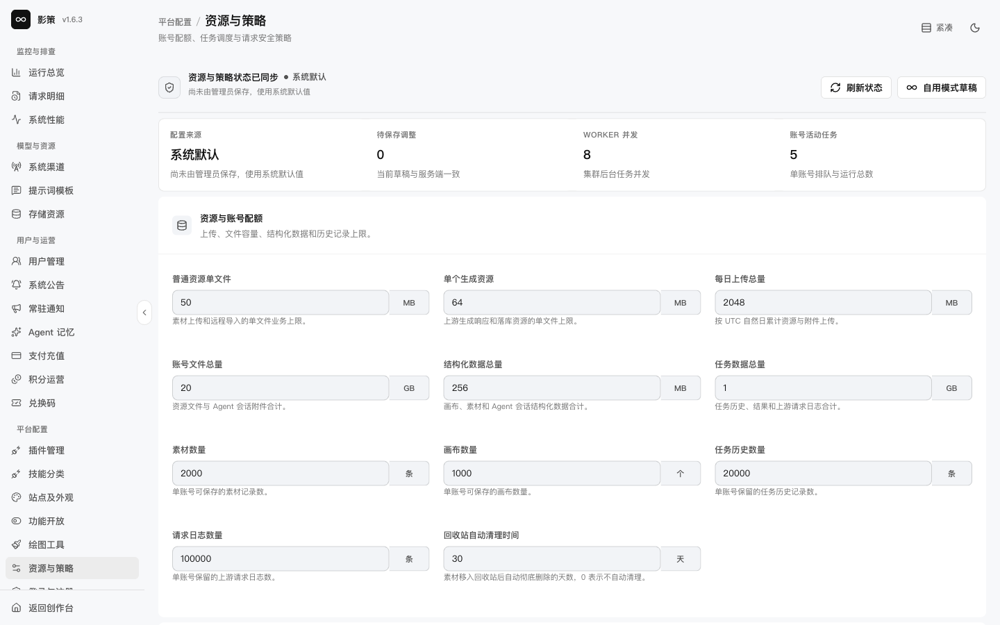

# 配置资源配额、任务并发和超时

## 适用角色

平台运维管理员、任务调度管理员。

## 目标

理解资源、并发、队列、超时和熔断之间的关系，尤其是区分后台任务最长执行时间与浏览器等待时间。

## 1. 认识策略分区

打开 `/admin/settings/runtime-policy`。页面分为资源与账号配额、对象存储运行时、任务与并发、任务超时、画布 Agent 单步、业务频控、渠道中转与熔断。

页面同时显示“系统默认”和“管理员配置”状态。先点击 **刷新状态**取得最新值，再按业务域记录修改前后值。

## 2. 调整任务超时前先看依赖

任务超时区域包含图片、文本、音频、视频、分镜和默认任务超时。**视频任务超时**是后台任务允许执行的最长时间；它与浏览器前端“等待视频生成”的超时不是同一个概念。

当前已知问题是：前端等待设置可能比真实视频生成时间短，导致页面先提示超时，而上游任务仍可能成功。排查顺序应是：

1. 到创作历史或请求明细确认任务是否仍在运行、已完成或已失败。
2. 检查请求阶段、渠道耗时和队列等待，而不是立即重复提交。
3. 如果后台任务本身也超时，再评估视频任务超时、Worker 并发、上游供应商耗时和积分冻结/释放行为。
4. 调高后台任务超时后，仍需单独修正或验证前端等待策略；不要把一个设置当成另一个设置的替代品。

## 3. 评估并发、频控和熔断

Worker 并发、单账号活动任务数、业务频控、系统/自定义渠道请求体与响应体、请求超时、熔断失败次数和持续时间共同决定队列行为。修改其中一项时，记录可能增加的上游压力、排队时间和失败重试。

## 4. 保存与恢复

只有在变更单、回滚值和观察指标都准备好后，才使用 **保存修改**。保存后观察请求明细、服务质量、排队和积分账务；出现异常时恢复到上一次经过验证的值，而不是连续盲目调大超时。

## 成功判据

- 能分别指出浏览器等待超时、后台任务超时、上游请求超时和熔断持续时间。
- 能解释调高视频后台超时的代价：任务占用、队列堆积、积分冻结时间和失败恢复成本。
- 调整后有可观测指标和回滚值。

## 取消、恢复与风险边界

本轮只读查看策略，未保存任何修改。超时设置是平台级策略；不能为了单个慢任务在生产环境临时改成无限等待，也不能通过重复提交绕过超时。
