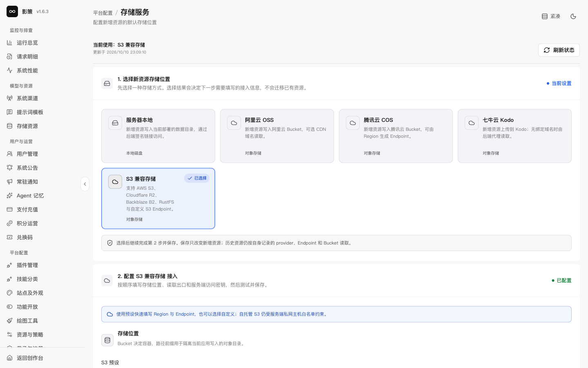
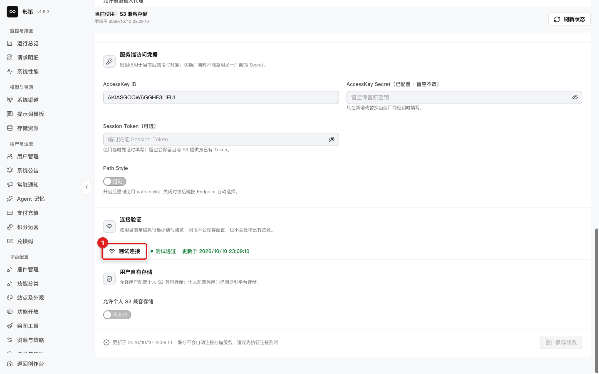
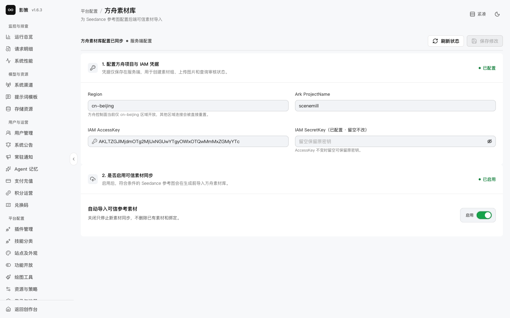
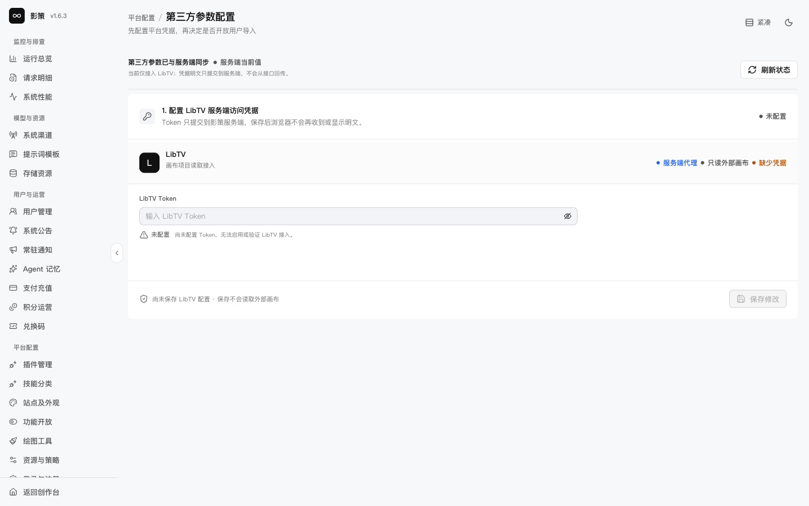

# 配置存储、方舟素材库和第三方参数

## 适用角色

存储管理员、平台集成管理员。

## 目标

理解对象存储、方舟素材库和第三方代理的配置边界，避免把连接测试、凭据保存和已有资源迁移混为一谈。

## 1. 存储服务

进入 `/admin/settings/storage`。可选服务器本地、阿里云 OSS、腾讯云 COS、七牛云 Kodo和 S3 兼容存储。字段包括 Bucket、路径前缀、Endpoint、CDN、鉴权、AccessKey、Secret、Session Token以及用户自有存储策略。

**测试连接**只验证连接，不保存配置，也不会迁移已有资源；测试前仍需确认使用的是隔离 Bucket 和最小权限密钥。

切换存储类型不会自动迁移历史资源。保存后要核对新上传、旧资源读取、CDN 访问和模型输入代理四条路径。

## 2. 方舟素材库

打开 `/admin/settings/ark-private-assets`。当前方舟 Region 只支持 `cn-beijing`，还包括 ProjectName、IAM 凭据和自动导入可信参考素材选项。

关闭自动导入只停止新素材同步，不删除已有素材和绑定。凭据只应保存在服务端；不要将 IAM SecretKey放入截图或客户端配置。

## 3. 第三方参数配置

进入 `/admin/settings/third-party`。当前仅接入 LibTV，Token只提交到服务端，不从接口回传；页面还提供服务端代理和只读外部画布选项。

保存前先确认外部服务的权限范围、超时、审计和撤销方式。本轮没有填写或保存 Token。

## 成功判据

- 能分辨连接测试、保存配置、资源迁移和新素材同步四个动作。
- 能解释 `storageKey` 物理存储证据与业务资源身份的差别。
- 凭据不会出现在 URL、日志、截图或浏览器可见正文中。

## 取消、恢复与风险边界

对象存储和外部素材库是数据完整性边界。保存前必须准备旧配置、回滚值和资源读取验证；物理删除失败时不能先删除素材记录。
