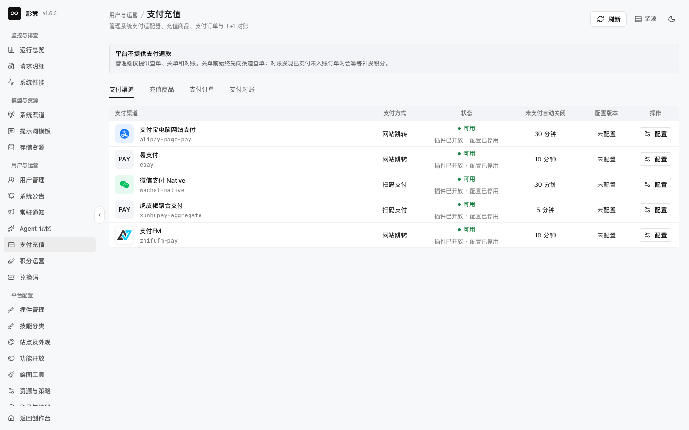
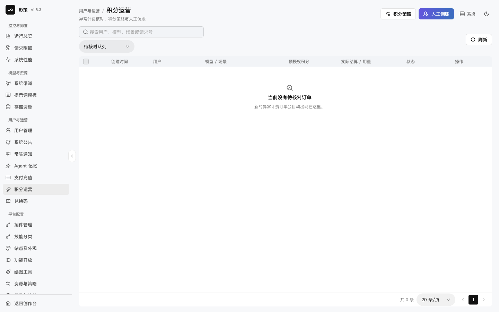
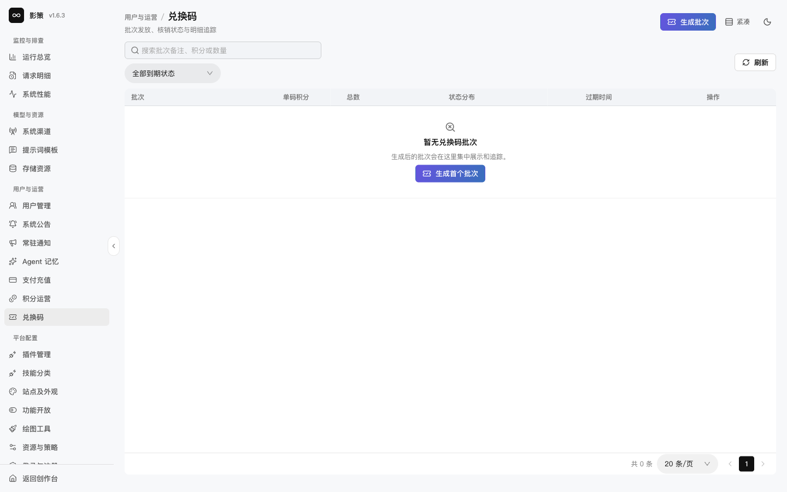

# 处理支付、积分和兑换码

## 适用角色

财务运营管理员、积分运营管理员。

## 目标

查看支付适配器、核对异常计费、执行有审计记录的积分操作，并避免重复补发或重复扣费。

## 1. 查看支付状态和订单

进入 `/admin/payments`，查看支付渠道、充值商品、支付订单和支付对账。当前开发环境显示支付适配器存在，但配置停用或未配置；页面也明确说明平台不提供支付退款。

关单前先向支付渠道查单。对账发现“已支付未入账”时，应使用幂等补发，而不是手工重复增加积分。本轮未查单、关单或执行对账。

## 2. 核对积分运营

打开 `/admin/credit-operations`，先看异常计费核对队列，再使用 **积分策略**或**人工调账**入口。人工调账必须关联工单、用户、原因和金额，并保留前后余额。

## 3. 管理兑换码批次

进入 `/admin/redemption-codes`，按到期状态查看批次。点击 **生成批次**前，先确定单码积分、总数量、过期时间、发放对象和泄露后的作废方案。

批次生成后应把明文分发视为一次敏感操作；不要将完整兑换码写进截图或公共日志。本轮未生成批次。

## 成功判据

- 能从支付订单、对账和积分账本三个层面核对一次充值。
- 知道平台不提供支付退款，退款或争议必须回到支付渠道和业务流程。
- 任何补发或调账都可以由工单和幂等键追溯。

## 取消、恢复与风险边界

支付查单、关单、对账、人工调账和兑换码生成都会改变财务或用户权益，不能用“先点一下看看”来验证。测试应使用隔离支付渠道和专用账号。
