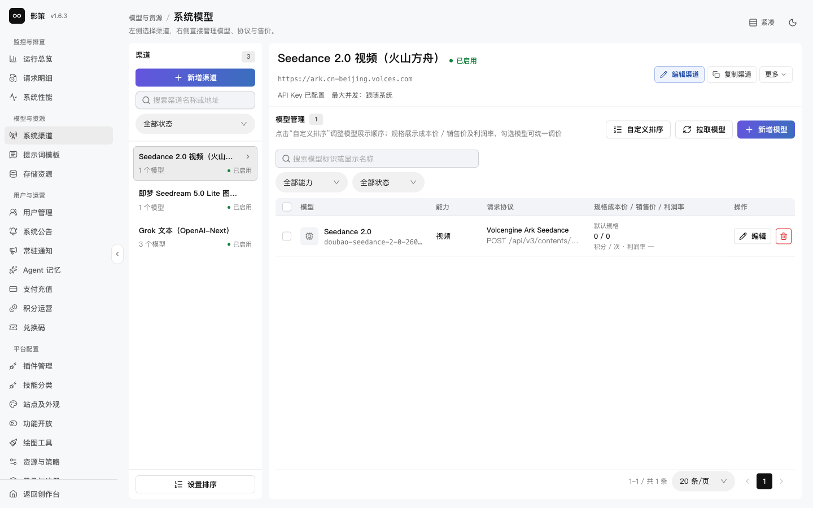
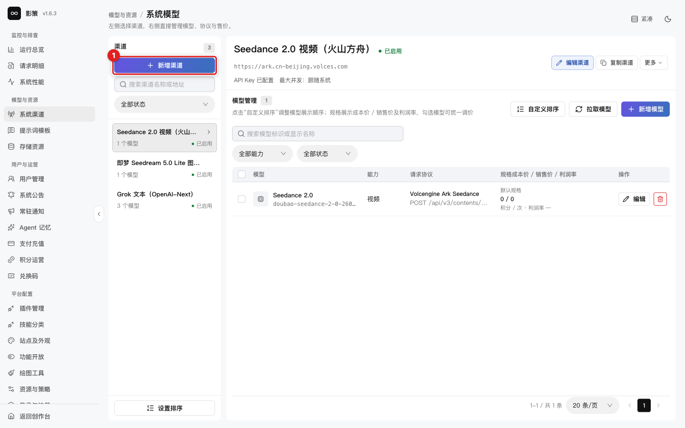
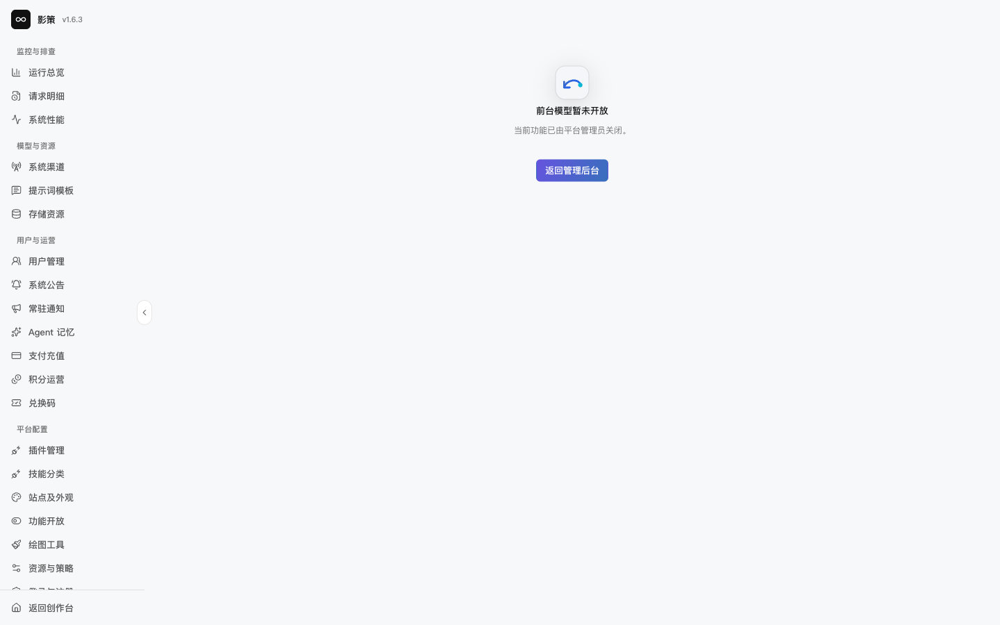
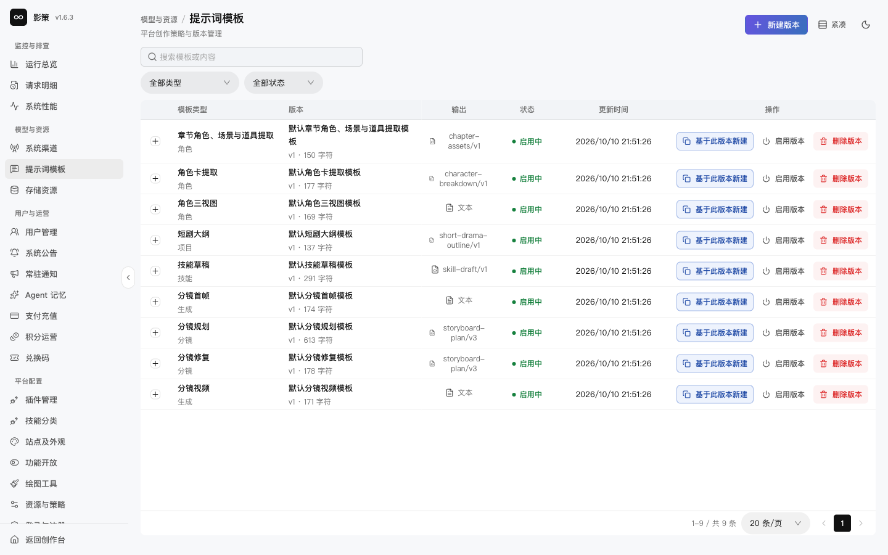
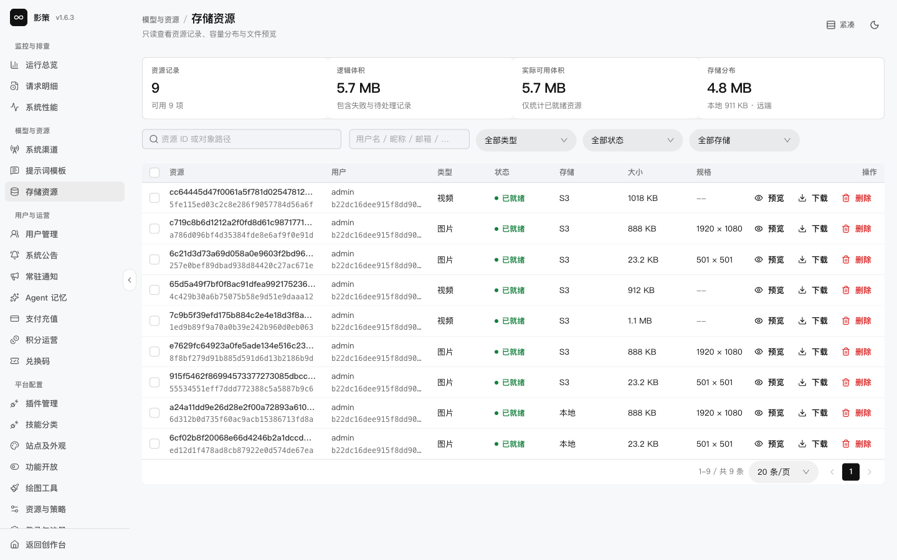

# 配置系统渠道、模型、提示词和资源

## 适用角色

模型平台管理员、资源管理员。

## 目标

查看渠道和模型状态，维护提示词版本，核对资源记录，并知道哪些操作会影响生成和数据完整性。

## 1. 查看系统渠道和模型

进入 `/admin/channels`。页面列出渠道状态、模型管理入口、最大并发和凭证状态。当前开发数据包含 Seedance 2.0 视频、即梦 Seedream 5.0 Lite 图片和 Grok 文本等系统渠道。

点击 **模型管理**查看模型，使用 **拉取模型**或**新增模型**前先确认上游协议和模型标识。**新增渠道**只在凭证、基地址、能力类型和并发策略都已准备好时使用。

API Key 页面只显示“已配置”而不显示明文。编辑或复制渠道时，确认不会把密钥写入截图、日志、URL或工单。

## 2. 查看前台模型开关

打开 `/admin/models`。当前页面显示“前台模型暂未开放，当前功能已由平台管理员关闭”，这表示功能开关状态，不是页面加载失败。

## 3. 管理提示词模板版本

进入 `/admin/prompt-templates`，可按类型和状态筛选。使用 **新建版本**或**基于此版本新建**创建草稿，核对模板类型、版本名称、模板内容和保存后的状态。启用中的版本不能直接删除；切换页面时若有未保存修改，先处理放弃编辑提示。

## 4. 查看存储资源

进入 `/admin/resources`，先看可用资源数、逻辑体积和实际可用体积，再按类型、状态和存储筛选。点击 **预览**或**下载**可以做只读核验。

删除资源前必须检查项目、画布、任务和其他业务引用。URL 存在不能单独证明资源已经物化；物理删除失败时不能先删除资源记录。本轮没有执行删除。

## 成功判据

- 渠道、模型和提示词版本的状态都能解释清楚。
- 资源的业务身份、物理存储和引用关系没有混为一谈。
- 不把更换模型或渠道当作任意失败时都可透明切换的操作；上游任务建立后应保持任务身份。

## 取消、恢复与风险边界

新增、编辑、删除渠道或模型、启用提示词、删除资源和保存凭据都是高影响写操作。先在隔离环境验证，再安排变更窗口；不要在共享开发数据上凭截图操作。
