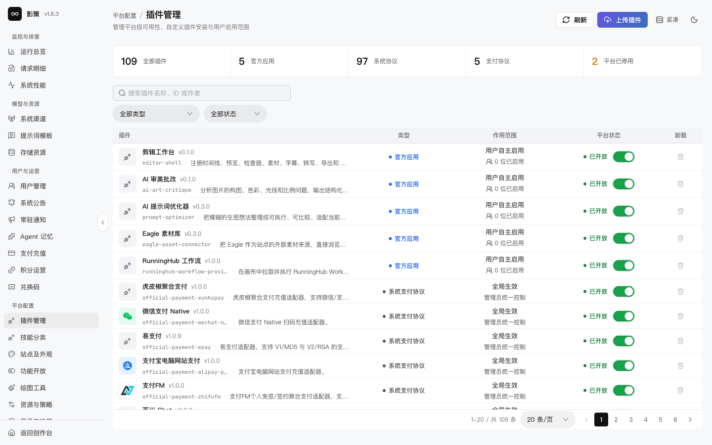
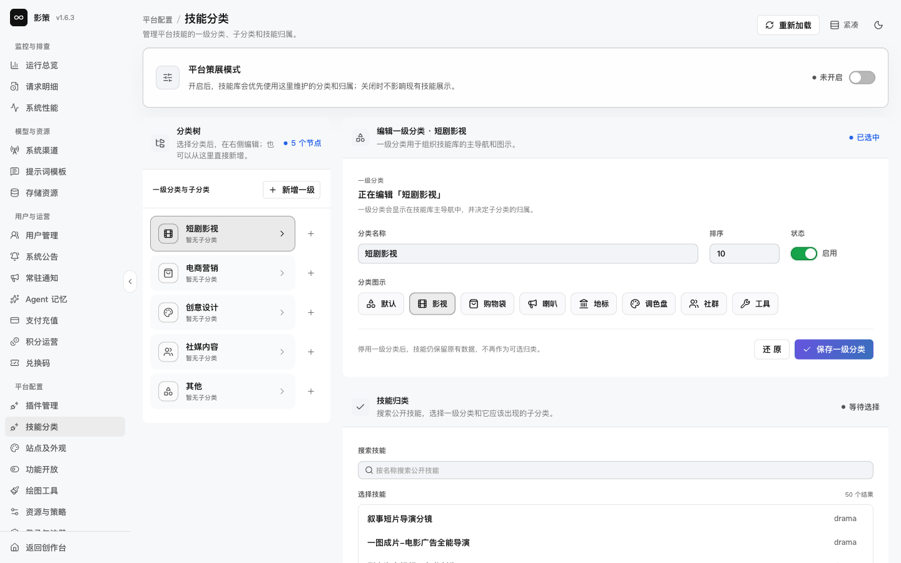

# 管理插件与技能分类

## 适用角色

平台能力管理员、内容策展管理员。

## 目标

区分插件的平台级状态与用户自主启用状态，维护技能分类，并确认分类修改不会误删技能。

## 1. 查看插件状态

进入 `/admin/plugins`，按官方应用、系统协议、支付协议等类型筛选。页面同时展示插件数量、平台状态和用户自主启用与管理员统一控制的区别。

**上传插件**、卸载或停用插件前，先检查依赖、调用权限、现有用户配置和回滚包。插件状态是平台级状态，不能把某个用户关闭插件理解成平台卸载。本轮未上传或卸载插件。

## 2. 维护技能分类

打开 `/admin/skill-curation`，当前有短剧影视、电商营销、创意设计、社媒内容和其他五个一级分类。平台策展模式当前未开启。

需要调整时，先编辑分类名称、排序、状态和图示，再在技能归类区域选择技能，最后使用 **保存技能归类**。保存前确认没有把技能从原分类误移走；本轮未保存修改。

## 成功判据

- 能说清平台停用、管理员统一控制和用户自主启用的差别。
- 能从当前分类和策展模式状态判断用户端会看到什么。
- 修改分类前有可恢复的旧配置快照。

## 取消、恢复与风险边界

刷新或筛选不会写入。上传、卸载、平台停用和保存归类属于平台级变更，应有发布记录和回滚方案。
