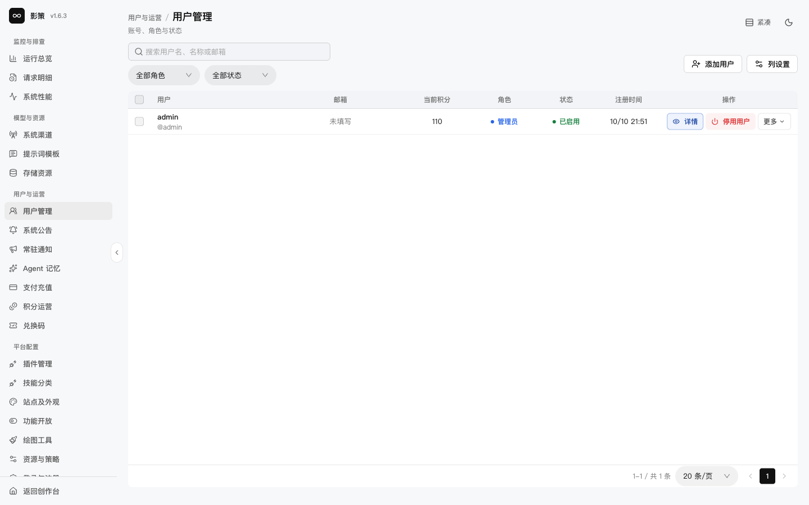
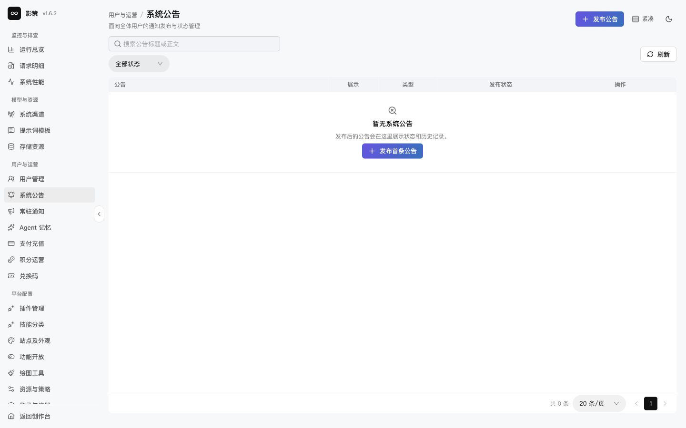
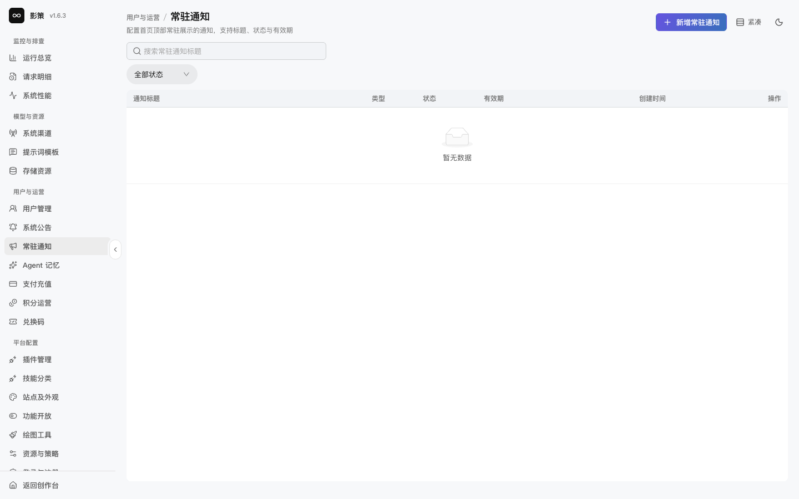
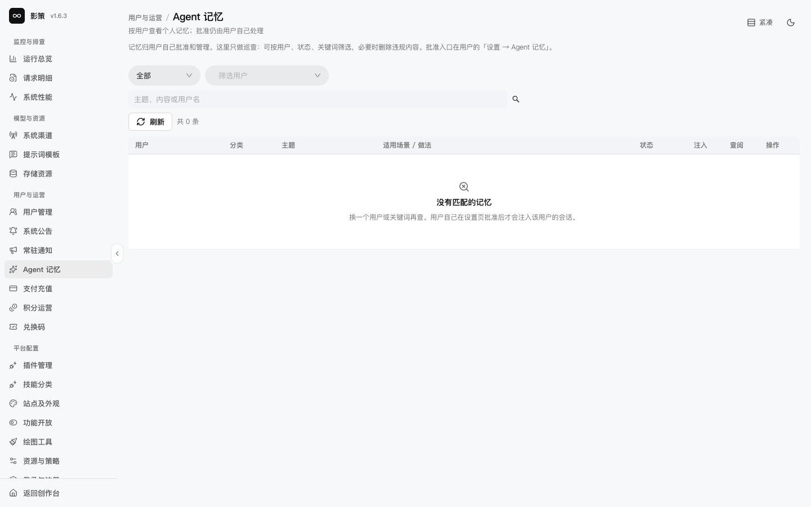

# 管理用户、公告和 Agent 记忆

## 适用角色

运营管理员、内容安全管理员。

## 目标

查看用户状态，准备公告和常驻通知，巡查 Agent 记忆，并明确每种操作的受影响人群。

## 1. 查看用户

进入 `/admin/users`，使用 **全部角色**、**全部状态**和**列设置**筛选表格。用户行提供 **详情**和**更多**操作。

停用用户、调整角色或积分前，先确认用户身份、工单授权、现有任务和恢复方式。停用会阻断登录或业务使用，不能只依赖前端隐藏按钮来判断权限。本轮没有停用或调账。

## 2. 发布系统公告和常驻通知

在 `/admin/announcements` 使用 **发布公告**；在 `/admin/banner-announcements` 使用 **新增常驻通知**。发布前核对展示范围、类型、状态和有效期。

公告会面向全体用户，常驻通知可能持续占据首页顶部。写入前准备可撤回版本和明确的结束时间；本轮只核对空状态和入口，没有发布通知。

## 3. 巡查 Agent 记忆

进入 `/admin/agent-lessons`，按用户、状态和关键词筛选。页面说明记忆由用户自己批准和管理，管理员这里只做巡查，必要时可以删除违规内容。

管理员不能代替用户批准记忆。删除违规内容也应保留原因和工单记录。

## 成功判据

- 能区分用户账户变更、全站公告、首页常驻通知和用户私有记忆。
- 每个高影响操作都能说出受影响范围和恢复方式。
- 没有把“空状态”误解为接口故障。

## 取消、恢复与风险边界

关闭弹窗或停留在筛选页不会产生写入。发布、删除、停用、改角色和调账需要单独授权；本手册不把页面打开或按钮可见写成操作成功。
