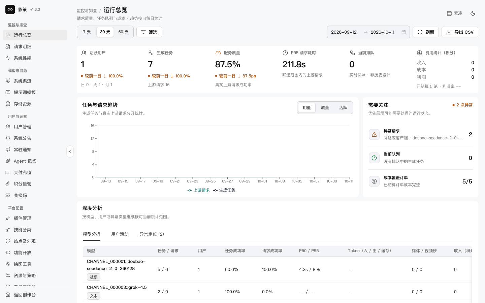
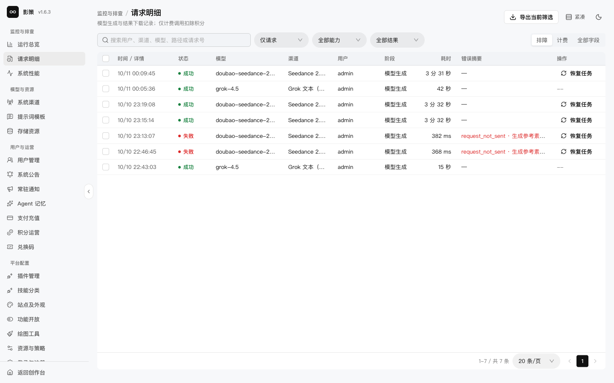
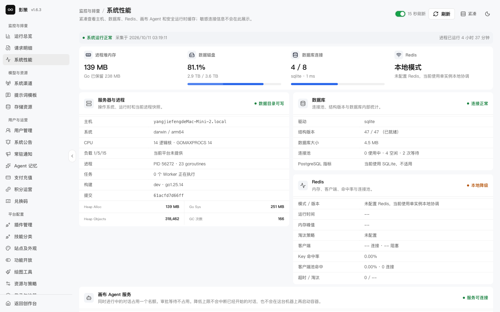

# 查看运行总览、请求明细和系统性能

## 适用角色

平台管理员、值班运维人员。

## 目标

从指标到单个请求逐层定位问题，区分排队、上游失败、资源错误和前端等待超时。

## 前置条件

- 已登录管理员账号。
- 需要处理单个用户请求时，先取得请求 ID或用户提供的时间范围。

## 1. 从运行总览判断范围

进入 `/admin`。顶部提供 **7 天**、**30 天**、**60 天**和自定义范围；页面同时展示活跃用户、生成任务、服务质量、P95 请求耗时、当前排队和费用统计。

观察趋势时先固定时间范围，再比较 **用量**、**质量**和**活跃**三个视图。点击 **导出 CSV** 前，确认导出的是当前筛选结果，而不是全量数据。

## 2. 查看请求明细

打开 `/admin/logs`，可选择 **仅请求**或**全部能力**，再按结果和用途筛选。点击记录进入请求详情抽屉，重点查看请求状态、模型、渠道、用户、阶段、耗时和错误摘要。

若页面提供 **恢复任务**，先确认该请求尚未被新的任务替换，且恢复不会重复建立计费或上游任务。恢复动作本轮没有执行。

## 3. 检查系统性能

打开 `/admin/settings/system-performance`，查看进程堆内存、数据磁盘、数据库连接、Redis 状态，以及服务器与画布 Agent 服务状态。

**刷新**只重新读取状态。**清理运行时缓存**会改变运行环境，只有在确认缓存可重建、并已记录影响范围后执行。

## 成功判据

- 能把问题归类到指标异常、请求阶段、上游渠道、资源或任务状态。
- 记录了请求 ID和时间范围，而不是只复制一段错误文案。
- 对视频超时问题，先在请求明细和创作历史确认任务是否仍在运行。

## 取消、恢复与风险边界

- 筛选和打开详情可以随时取消。
- 任务恢复、运行时缓存清理和导出含敏感字段的数据，都需要按团队流程留痕。
- 指标健康不能证明真实模型生成、SSE 断线重连或跨设备同步已经通过验证；需要专项验证。
