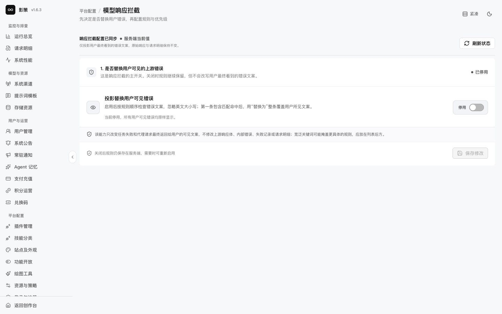
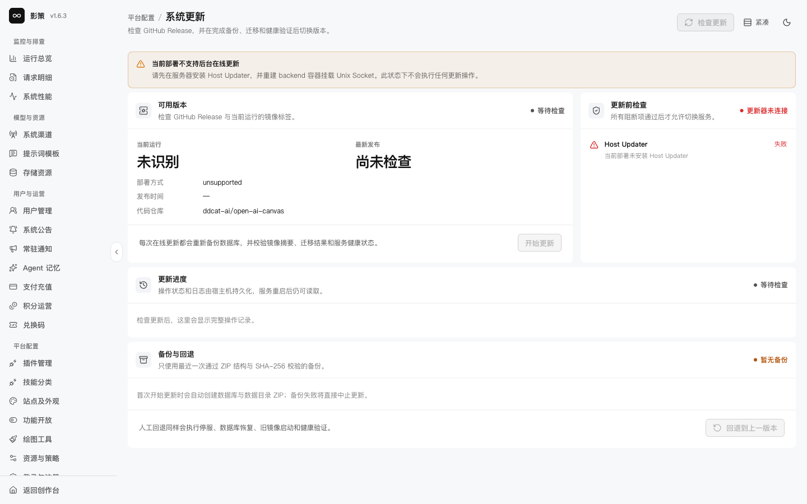
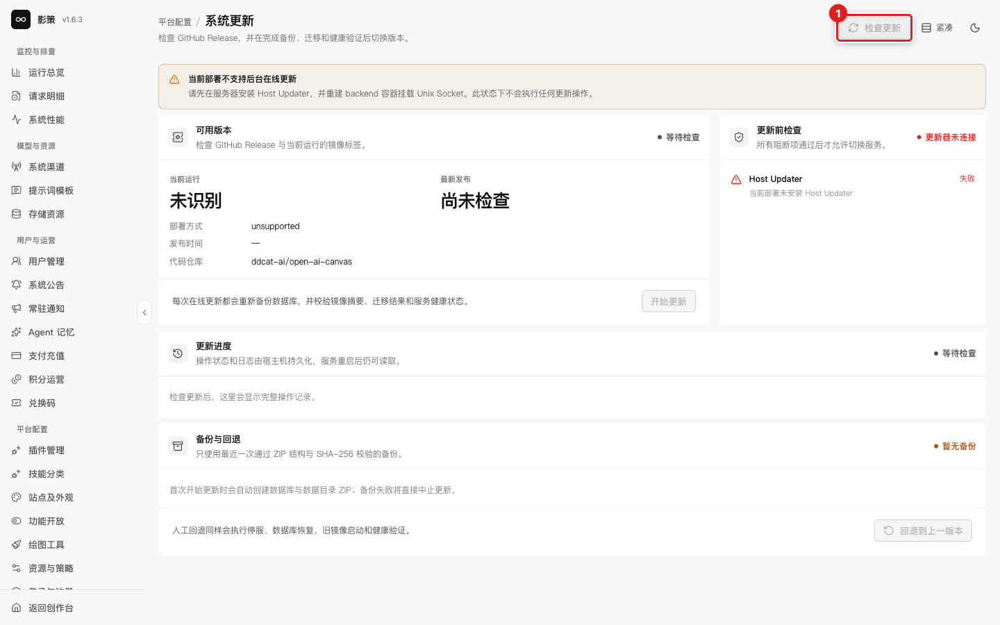

# 配置响应拦截与系统更新

## 适用角色

平台运维管理员、发布管理员。

## 目标

在不改变上游事实的前提下改善用户可见错误文案，并判断当前部署是否具备在线更新条件。

## 1. 模型响应拦截

进入 `/admin/settings/response-interception`。当前功能停用。启用后规则按顺序匹配，第一条命中后替换用户可见错误文案；它不会修改上游响应体、内部错误、失败记录或请求明细。

具体关键词应放在宽泛关键词前面，避免一条通用规则提前命中。保存前准备命中样例和恢复旧规则；本轮未启用规则。

## 2. 系统更新

打开 `/admin/settings/system-update`。当前部署不支持后台在线更新，需要 Host Updater和 Unix Socket；页面会显示检查 GitHub Release、更新前检查、备份与回退等区域。

**检查更新**是读取版本信息，但不能替代备份、兼容性和回退演练。**开始更新**和**回退到上一版本**属于高风险操作，本轮没有执行，也没有把按钮可见写成部署支持。

## 成功判据

- 能区分用户可见文案替换与上游错误事实。
- 能判断当前部署是否具备在线更新所需的 Host Updater 和 Unix Socket。
- 更新前有备份、观察窗口和回退方案。

## 取消、恢复与风险边界

停用拦截、关闭弹窗或离开页面不会修改配置；保存规则、开始更新和回退都需要单独授权。生产更新不能仅凭本地页面截图验收。
