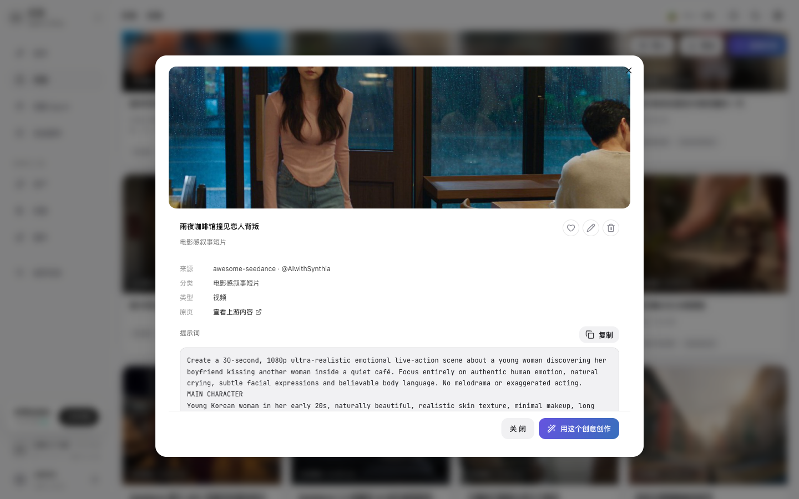

# 浏览灵感库并带入创作

## 适用角色
创作者。

## 目标
从灵感库筛选一个可复用的提示词，查看完整内容，再把它带回创作页继续修改。

## 步骤

1. 从侧栏点击 **灵感**。页面顶部会显示灵感总数，下面按创作类型和分类筛选。

灵感库可以按 **全部**、**图片**、**视频**、**文本**切换，也可以点击“按分类筛选”中的标签，例如 **电影感叙事短片** 或 **手持 UGC Vlog**。这些筛选只改变列表，不会立即开始生成。

2. 点击一张灵感卡片，打开详情对话框。

详情里会显示标题、类型、来源、分类、上游内容链接和完整提示词。先阅读提示词，再决定是否使用；不要把卡片标题当作完整提示词。

3. 在详情底部点击 **用这个创意创作**。

系统会跳转到 `/create`，并将提示词填入创作输入框。这个动作只填充输入，不会自动扣积分或启动生成。

4. 在创作页修改提示词，选择图片、视频或文本模式，再点击 **开始创作**。

## 成功判据
浏览器地址进入 `/create`，创作提示词输入框中出现所选灵感的完整文本。

## 相关任务
- [用提示词生成图片](generate-image.md)
- [用提示词生成视频](generate-video.md)
- [使用技能库](browse-skills.md)

## 排障

- **找不到刚才的灵感**：回到灵感页，使用创作类型或分类筛选；分页会保留当前筛选条件。
- **详情中的上游链接打不开**：上游链接属于外部内容，先复制提示词到创作页继续工作。
