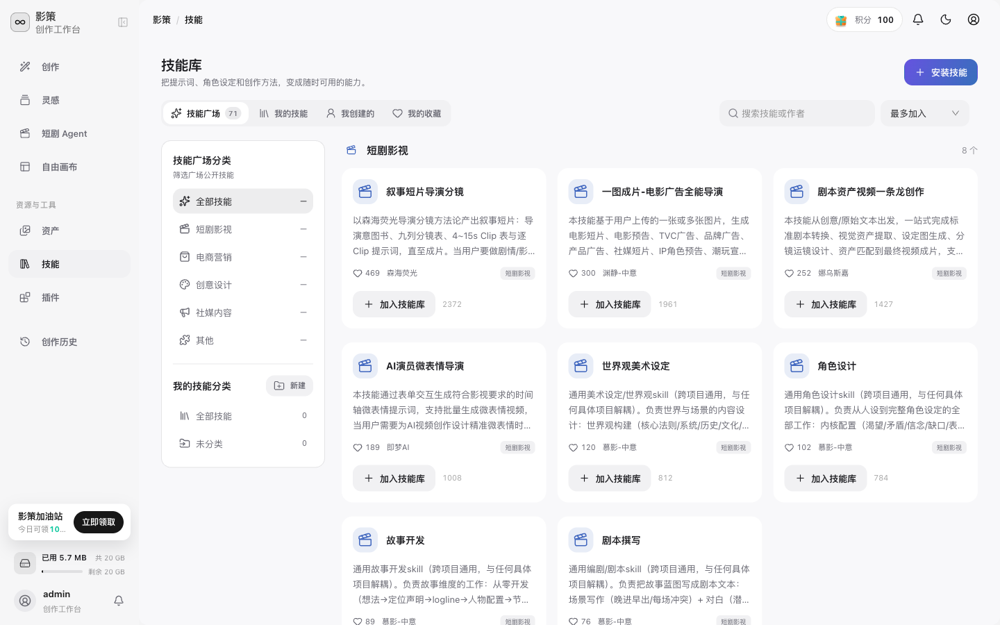
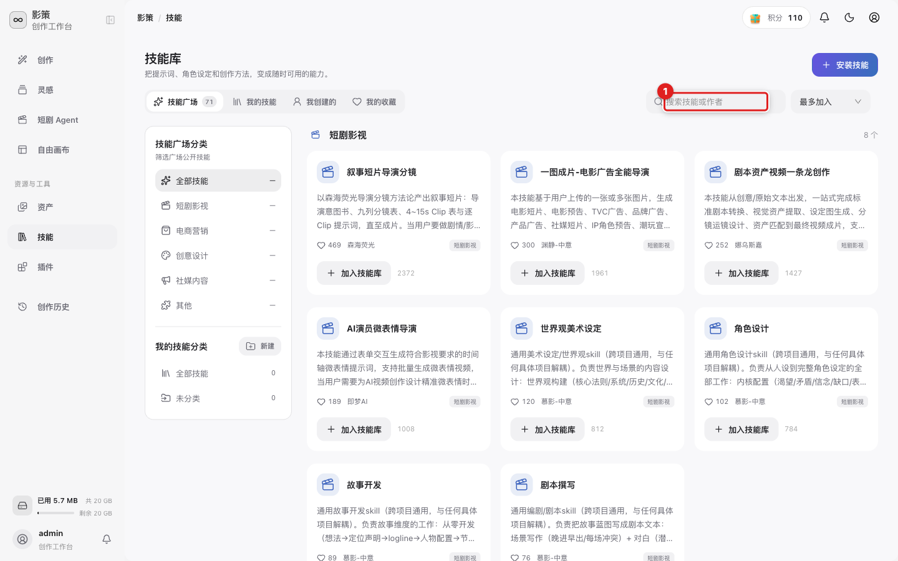
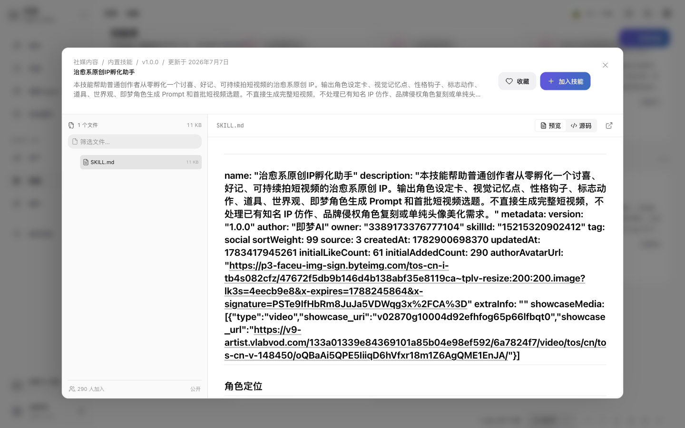

# 浏览和使用技能

## 适用角色
创作者。

## 目标
在技能广场找到适合当前任务的技能，阅读说明后加入自己的技能库，并在创作输入中调用。

## 步骤

1. 从侧栏点击 **技能**，进入技能库。

页面顶部有 **技能广场**、**我的技能**、**我创建的**、**我的收藏**四个范围。左侧分类可以筛选 **短剧影视**、**电商营销**、**创意设计**、**社媒内容** 等类别。

2. 在 **搜索技能或作者** 中输入关键词，或点击左侧分类缩小范围。

搜索只改变列表，不会安装或运行技能。先查看卡片上的用途说明、作者和分类。

3. 点击技能卡片查看完整说明。

详情可能包含适用范围、输入要求、输出格式和限制。确认技能适合当前任务后，再返回卡片点击 **加入技能库**。

4. 在创作页或画布节点的输入框中输入 `@`，从弹出的技能列表中选择已加入的技能。
5. 完成提示词后点击 **开始创作**。技能会作为本次请求的上下文，不会单独生成任务。

## 成功判据
技能出现在 **我的技能** 中；创作输入框中出现 `@技能名`，并可以继续提交创作。

## 排障

- **搜索没有结果**：清空筛选条件，检查关键词是否包含作者名或技能标题中的完整词。
- **加入技能库按钮不可用**：技能可能已加入、被管理员停用或当前账号没有权限。
- **@ 后没有列表**：确认焦点仍在创作输入框，等待技能列表加载完成后再输入一次 `@`。
