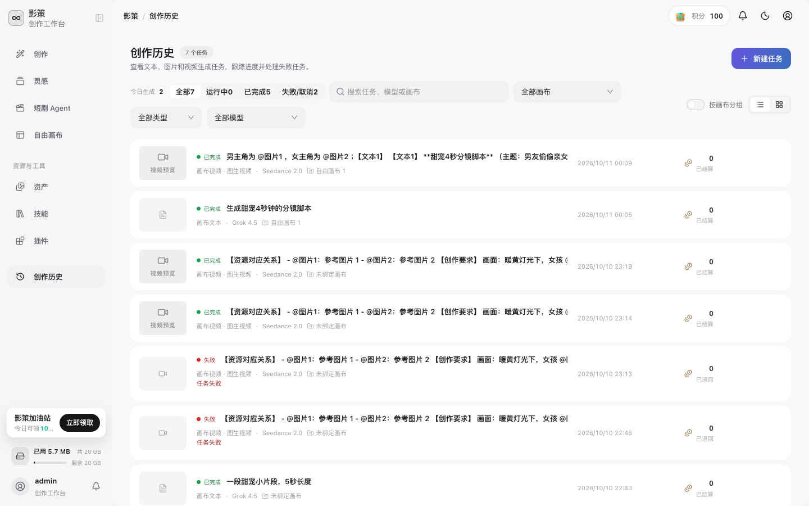
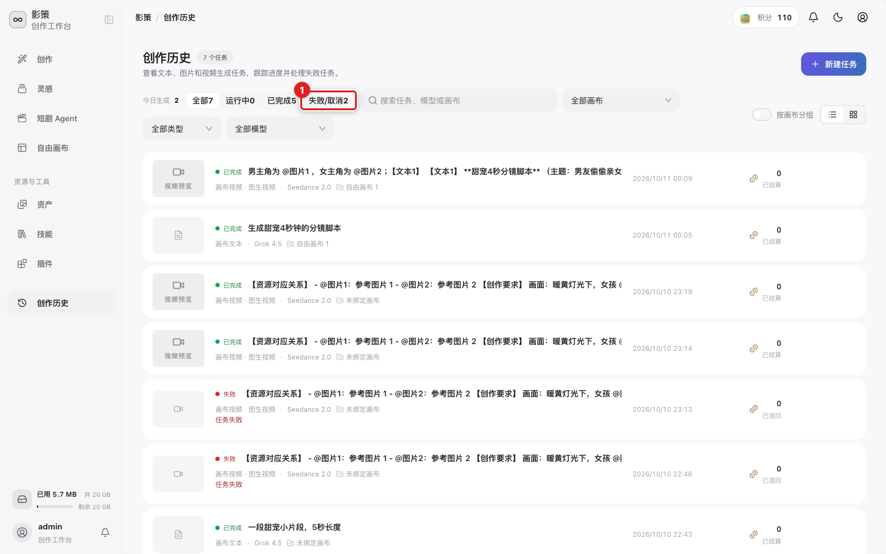

# 查看创作历史并处理失败任务

## 适用角色
创作者。

## 目标
按状态、画布、类型或模型查找任务，确认结果是否完成，并在失败时进入详情或重试。

## 步骤

1. 从侧栏点击 **创作历史**。

页面顶部显示今日生成数量和任务总数。列表中的每条任务会显示状态、任务类型、模型、时间和积分结算结果。

2. 使用状态筛选：**全部**、**运行中**、**已完成**、**失败/取消**。遇到视频生成等待过久时，先点击 **运行中**，再点击 **失败/取消** 确认是否已经被记录为失败。

3. 需要缩小范围时，在 **搜索任务、模型或画布** 中输入关键词，并使用画布、类型、模型筛选器。
4. 点击任务卡片上的 **查看详情**，检查完整提示词、模型、错误信息和积分状态。
5. 只有在任务明确显示失败且积分已退回时，才点击 **重试任务**。

## 成功判据
你能在列表中看到任务最终状态，并能从详情判断是否需要重试；已完成任务显示结果预览或下载入口。

## 视频超时说明
前端等待时间可能短于视频实际生成时间。界面提示超时并不等于上游任务已经失败；先刷新创作历史，确认任务是否仍在运行或后来变为已完成，避免重复提交和重复扣费。
