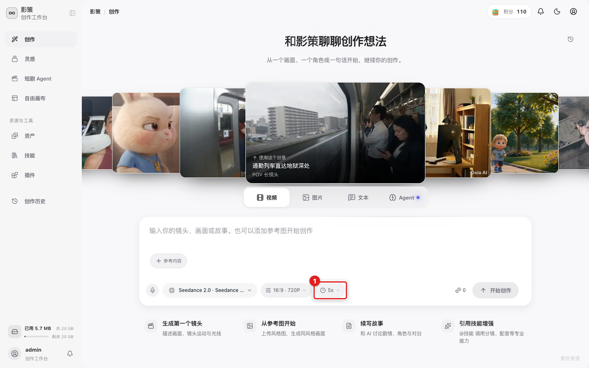
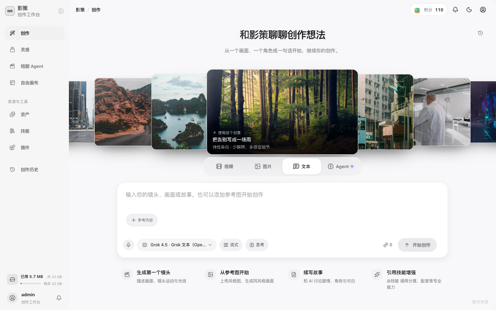
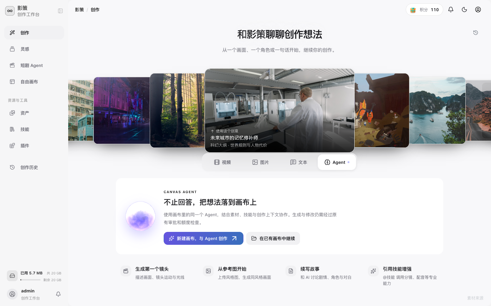

# 选择创作模式

## 适用角色
所有创作者。

## 目标
根据任务选择图片、视频、文本或 Agent 模式，理解每个模式的输入和提交方式。

## 图片模式

1. 在首页创作区点击 **图片生成**。

2. 在提示词框描述画面，点击模型按钮选择图片模型，点击比例按钮选择画幅。
3. 点击 **开始创作**。图片生成结果会出现在当前创作区域，并进入资产或创作历史。

## 视频模式

1. 点击 **视频生成**。

视频模式会显示模型、画幅、清晰度和时长参数。先检查时长，再决定是否提交。

2. 确认模型、**生成设置**（如 `16:9 · 720P`）和 **视频时长**（如 `5 秒`）。
3. 可以添加参考内容后再提交。视频生成通常比图片更慢；界面提示超时后先去创作历史确认最终状态。

## 文本模式

1. 点击 **文本生成**。

2. 选择文本模型；**流式**控制是否边生成边显示，**思考**控制是否使用更长的推理过程。
3. 输入问题或故事要求，点击 **开始创作**。文本结果会在当前对话中持续追加。

## Agent 模式

1. 点击 **Agent**。

2. 选择 **新建画布，与 Agent 创作**，或 **在已有画布中继续**。
3. 选择已有画布时，系统会进入画布列表（URL 带 `?agent=1`），再打开目标画布。
4. Agent 会结合画布中的素材、技能和创作上下文工作；生成和修改仍需经过审批与额度检查。

## 成功判据
模式按钮显示选中状态，相关模型和设置控件出现，提交后结果出现在当前创作区或目标画布。
