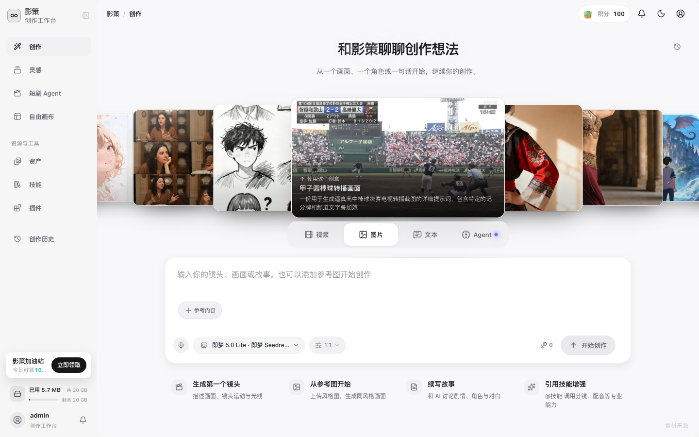

# 用提示词生成视频

## 适用角色
创作者。

## 目标
从首页视频模式提交一段视频生成任务，并在创作历史中确认最终状态。

## 步骤

1. 点击 **视频生成**。

2. 输入镜头、主体、动作和画面风格。需要图生视频时，先点击 **添加更多参考内容** 上传参考图。
3. 点击 **选择视频模型**，确认模型；点击 **生成设置：16:9 · 720P** 和 **视频时长：5 秒** 调整参数。
4. 检查发送按钮上的积分提示，再点击 **开始创作**。
5. 生成期间打开 **创作历史**，用 **运行中** 筛选查看任务，而不是重复点击提交。

## 成功判据
真实提交后，任务在创作历史中变为 **已完成**，并出现视频预览或下载入口。本次手册审计只验证了提交前控件、已有任务状态和超时恢复路径，没有触发新的真实视频生成。

## 视频超时处理

当前系统的前端等待超时可能短于上游视频实际生成时间。看到“任务执行超时”或“网络异常”时：

1. 不要立即重新生成。
2. 到 **创作历史** 查看任务是否仍为 **运行中**。
3. 若稍后变成 **已完成**，直接使用原结果。
4. 只有任务明确为 **失败** 且积分显示已退回时，才考虑重试。

## 取消/恢复
提交后通常不能取消。失败时先查看详情中的错误和积分结算记录，再决定是否重试。
