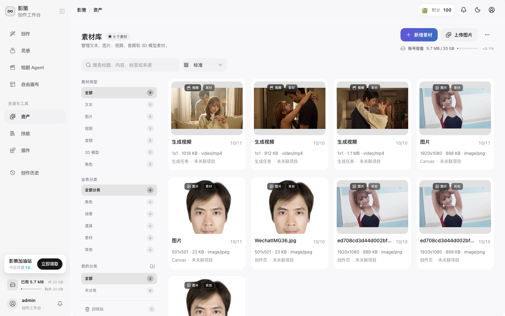
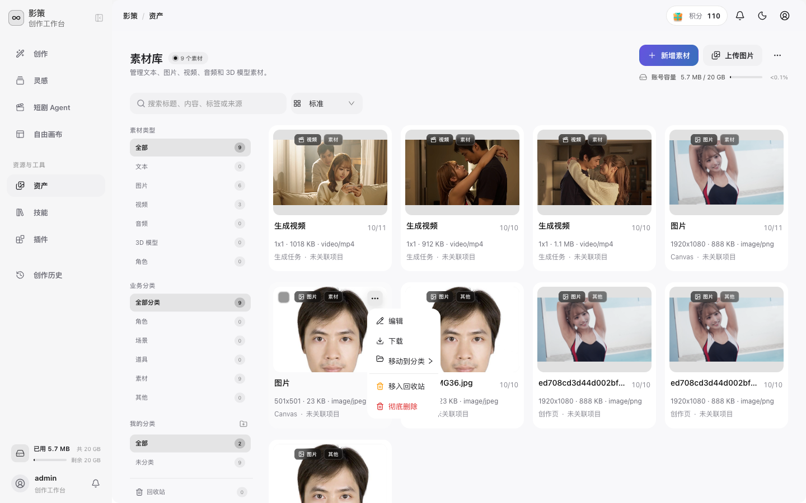
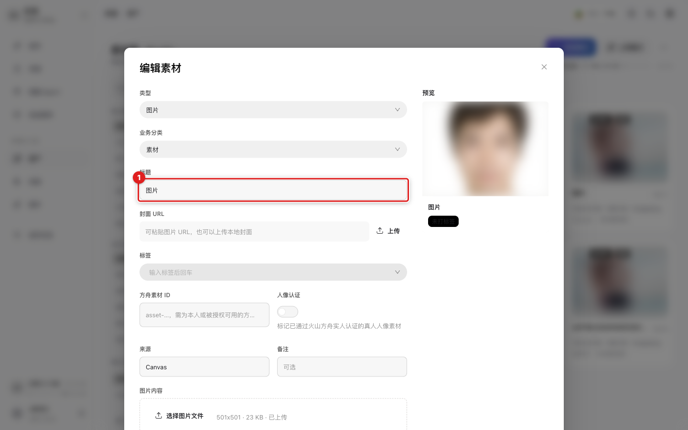

# 管理素材

## 适用角色
创作者。

## 目标
查看素材、上传图片、按类型筛选、编辑元数据，并把素材用于画布或创作。

## 浏览与筛选

1. 从侧栏点击 **资产**，进入素材库。

页面会显示素材总数、账号容量、素材类型和业务分类。左侧的 **图片**、**视频**、**音频**、**3D 模型**、**角色**筛选只影响列表，不会删除素材。

2. 在 **搜索标题、内容、标签或来源** 中输入名称或标签，或使用顶部的排序下拉框。
3. 点击素材卡片上的预览按钮，查看原始素材和元数据。

## 上传图片

1. 点击右上角 **上传图片**，选择本地文件。
2. 等待上传完成；素材卡片出现后，确认类型、大小和来源信息。
3. 需要同时管理文本、视频或音频时，点击 **新增素材**，选择对应类型。

上传会占用账号容量。上传失败时先检查文件格式、大小和剩余容量。

## 编辑素材信息

1. 在素材卡片右上角点击 **更多素材操作**，打开操作菜单。

支持元数据编辑的素材会在菜单中显示 **编辑**；**下载**用于保存本地副本；**移入回收站**和**彻底删除**分别对应可恢复和不可恢复的删除路径。不同素材类型的菜单项可能不同。

2. 如果菜单中出现 **编辑**，选择它。

3. 修改 **标题**，必要时补充 **业务分类**、**标签**、**来源**、**备注**。标题应使用容易检索的名称；标签输入后按 Enter 保存为标签。
4. 如果素材用于火山方舟人像能力，可在 **方舟素材 ID** 填写已授权的 ID，并按实际情况打开 **人像认证**。
5. 点击 **保存**。不想保存时点击 **取消** 或关闭对话框。

## 删除或下载

打开素材的 **更多素材操作** 菜单，可以看到 **下载**、**移入回收站** 和 **彻底删除**。删除前先确认项目、画布和任务没有继续引用它；彻底删除属于不可逆操作。

## 在画布中使用

打开画布左侧 **资产** 面板，按素材、角色、场景、道具或其他筛选，再点击素材旁的 **插入画布**。素材会作为节点出现在画布中。

## 成功判据
新素材出现在列表中；如果素材支持编辑，保存后的标题或标签可被搜索到；插入画布后能看到对应节点。
