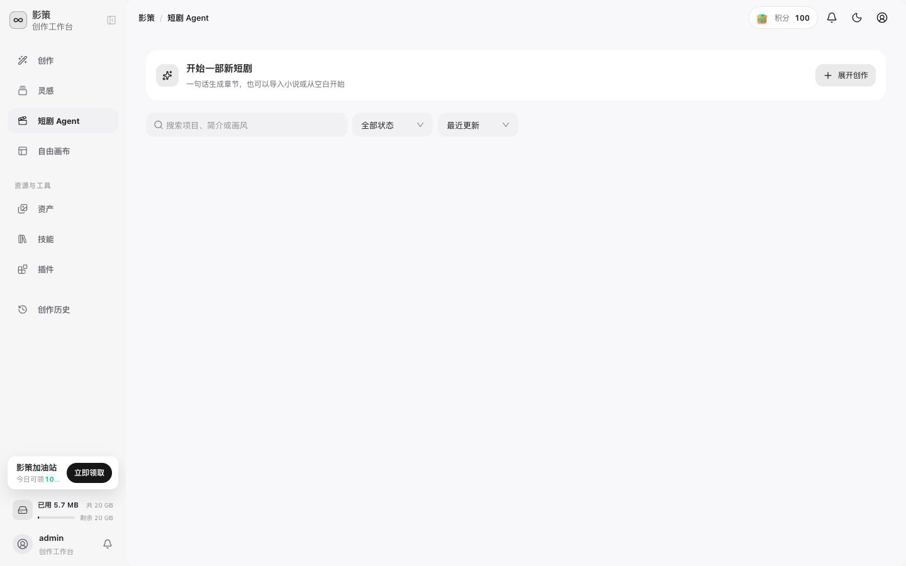
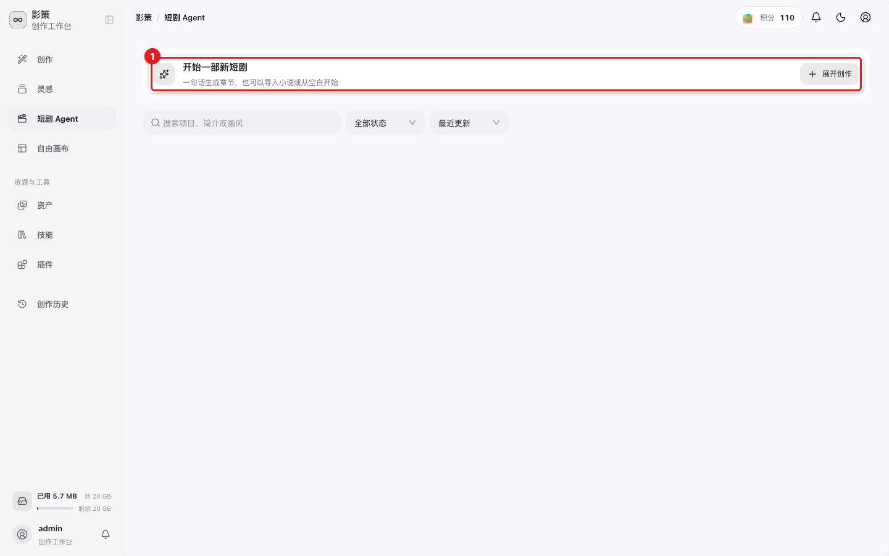
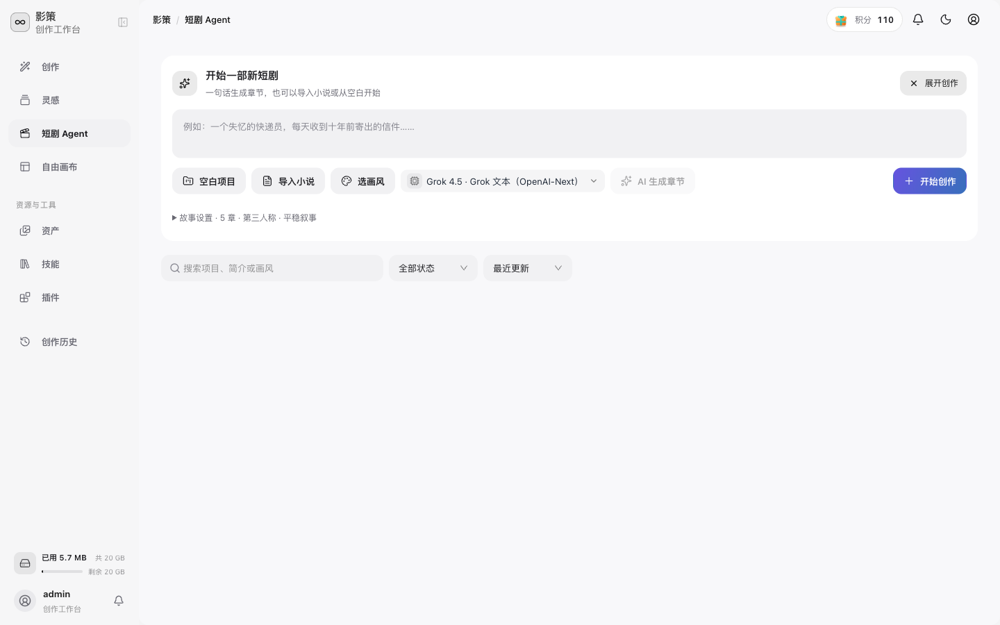
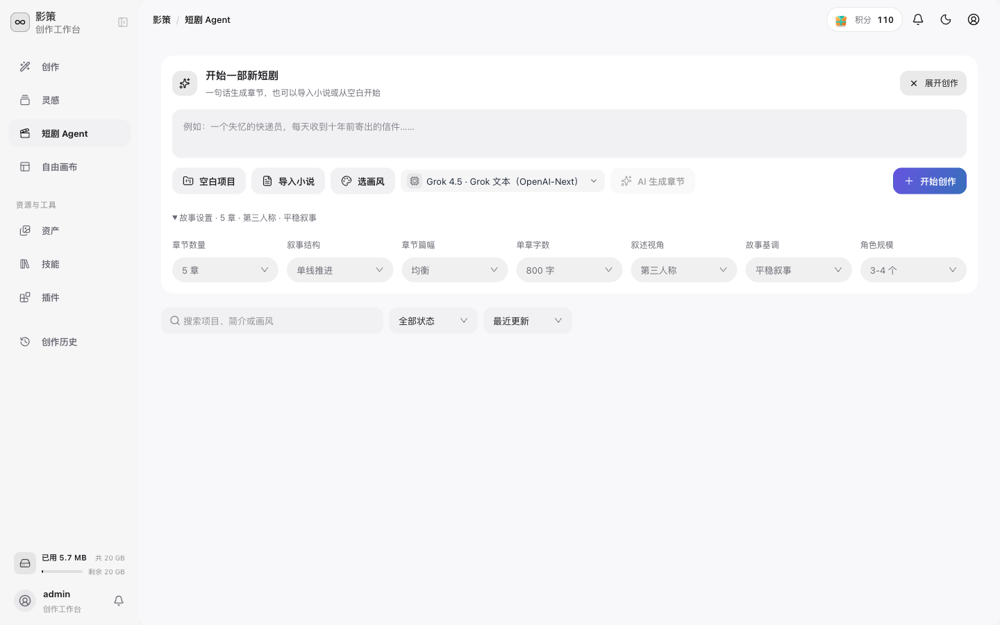

# 从一句话创建短剧项目

## 适用角色
需要连续管理章节、分镜和生成任务的创作者。

## 目标
使用短剧 Agent 的一句话故事入口创建一个项目，并在生成前设置章节参数。

## 步骤

1. 从侧栏点击 **短剧 Agent**。页面顶部有 **开始一部新短剧** 入口。

2. 点击“开始一部新短剧”卡片中的 **展开创作**，展开创作面板。

展开后可以看到故事输入框、导入方式、模型选择和提交按钮。

3. 在 **一句话故事** 中输入故事核心，例如“一个失忆的快递员，每天收到十年前寄出的信件”。
4. 根据需要选择 **空白项目**、**导入小说** 或 **选画风**。选择文本模型只改变后续生成使用的模型。
5. 点击 **故事设置 · 5 章 · 第三人称 · 平稳叙事**，调整章节数量、叙事结构、章节篇幅、单章字数、叙述视角、故事基调和角色规模。

6. 确认设置后，点击 **AI 生成章节** 或 **开始创作**。这一步会创建或推进项目内容，可能消耗积分，提交前先确认模型和故事设定。

## 成功判据
项目出现在项目列表中，进入详情后可以看到章节或后续工作流入口。

## 排障

- **AI 生成章节不可点击**：先填写“一句话故事”，或检查当前模型是否可用。
- **设置不符合预期**：重新打开故事设置，确认章节数和单章字数后再提交。
