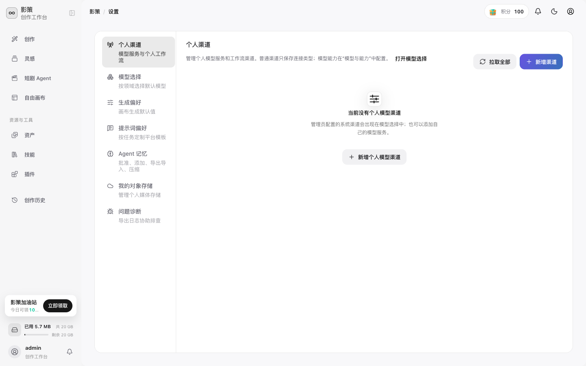
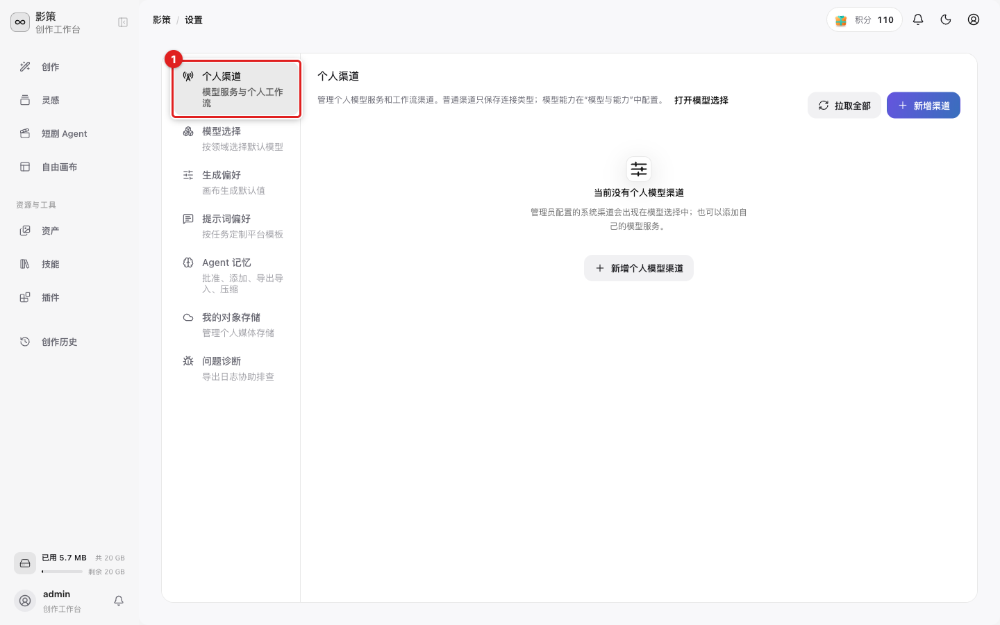

# 配置个人渠道和创作偏好

## 适用角色
需要使用个人模型渠道、调整默认生成设置或排查问题的创作者。

## 入口

点击账户菜单中的 **账户与设置**，进入 `/settings`。

左侧配置分类包括 **个人渠道**、**模型选择**、**生成偏好**、**提示词偏好**、**Agent 记忆**、**我的对象存储** 和 **问题诊断**。

## 添加个人模型渠道

1. 点击 **个人渠道**。

2. 点击 **新增渠道** 或 **新增个人模型渠道**。
3. 选择渠道类型，填写服务地址和授权信息，保存后点击 **拉取全部** 检查模型是否可用。
4. 到 **模型选择** 为图片、视频、文本等任务选择默认模型。

不要把 API Key 粘贴到截图、工单或公开文档中。无法确认渠道是否可用时，先在模型选择中检查状态，再回到创作页提交低成本测试。

## 调整默认值

- **生成偏好**：设置画布生成默认值。
- **提示词偏好**：按任务选择平台模板。
- **Agent 记忆**：管理批准、添加、导出、导入和压缩。
- **我的对象存储**：配置个人媒体存储。
- **问题诊断**：导出日志协助排查，不要把包含密钥或 Cookie 的日志公开发送。

## 成功判据
保存后重新打开设置页仍能看到新配置，创作页的模型或生成设置反映默认值。
