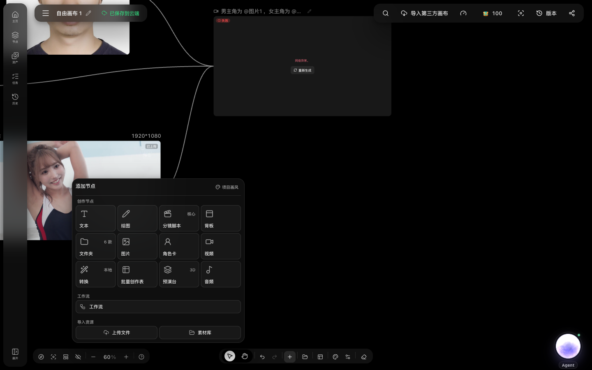
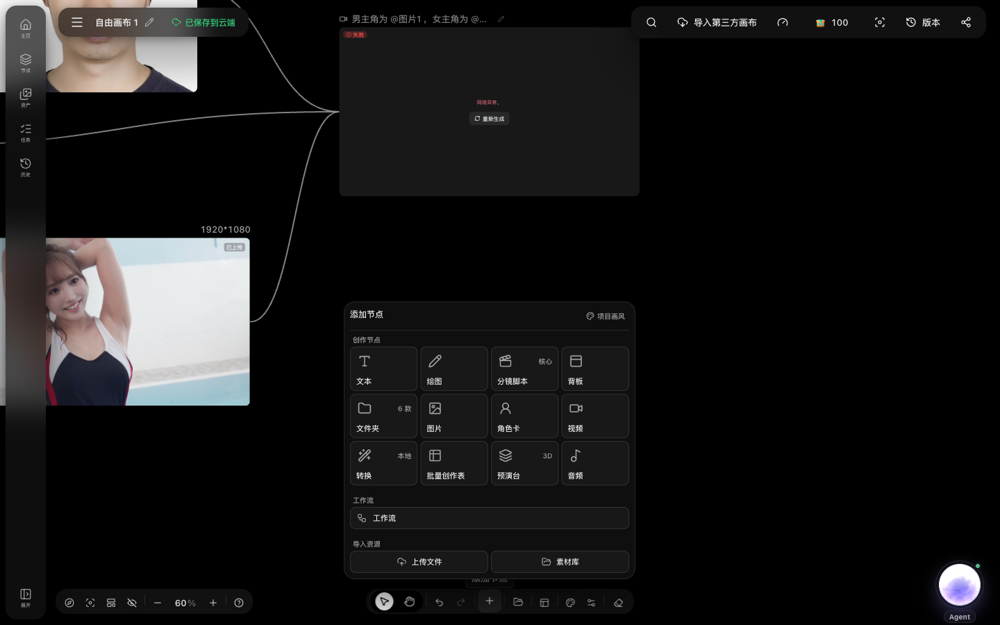
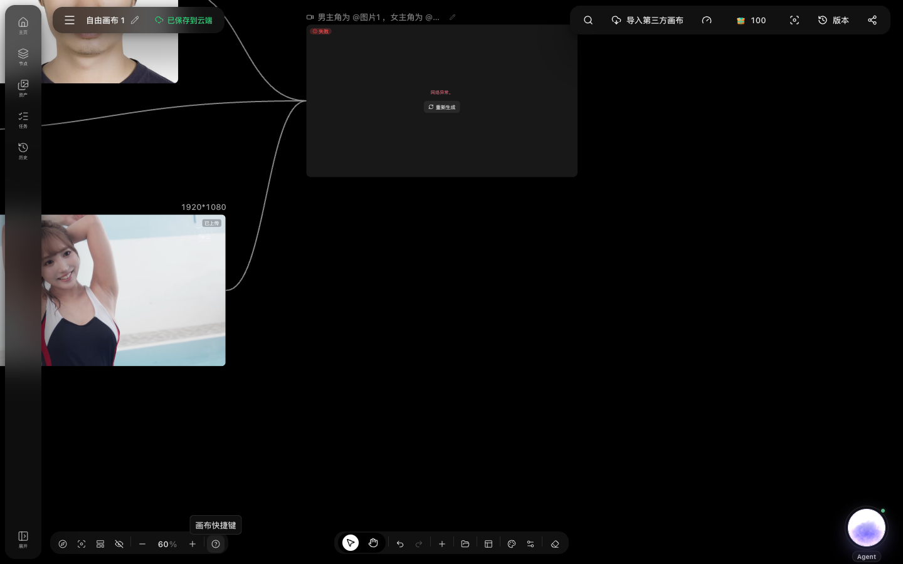
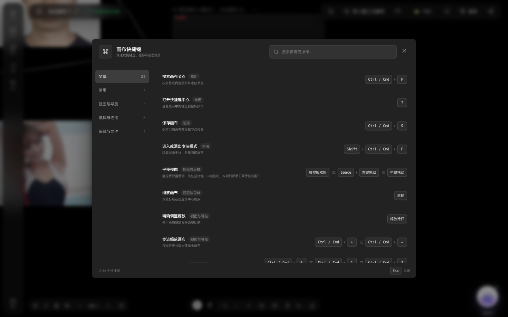

# 使用自由画布

## 适用角色
创作者。自由画布是影策的旗舰创作功能，适合需要同时管理角色、场景、分镜脚本和生成结果的场景。

## 目标
创建画布、添加节点、连接节点、生成图片或视频，并保存回画布。

## 前置条件
- 已登录。
- 如需生成视频，账号有可用积分。

## 入口

从侧栏点击 **自由画布**，进入画布列表页。在列表页可以：

- 点击 **新建画布** 创建空白画布；
- 点击 **导入** 导入第三方画布；
- 使用 **搜索画布**、**按所属项目筛选**、**画布排序** 查找画布；
- 每张画布卡片右上角有 **重命名** 和 **画布操作** 按钮。

## 画布界面总览

打开一张画布后，界面分为四个区域：

1. **左侧菜单**：主页、节点、资产、任务、历史、展开面板。
2. **顶部工具栏**：画布菜单、画布名（可重命名）、保存状态、搜索节点、导入第三方画布、媒体性能模式、积分、专注模式、版本记录、分享画布。
3. **画布主区域**：节点和连线在这里展示和编辑。
4. **底部工具栏**：区域选择/抓手切换、撤销重做、添加节点、素材库、工作区、画布外观、工具栏设置、清空画布。

## 添加节点

1. 点击底部工具栏的 **添加节点**，弹出节点类型面板：

2. **创作节点** 包括：
   - **文本**：纯文本便签或提示词来源；
   - **绘图**：AI 绘图节点；
   - **核心 · 分镜脚本**：结构化分镜表；
   - **背板**：画布背景装饰；
   - **文件夹**（6 款）：组织节点分组；
   - **图片**：图片生成节点；
   - **角色卡**：角色设定卡片；
   - **视频**：视频生成节点；
   - **本地 · 转换**：本地文件格式转换；
   - **批量创作表**：批量任务；
   - **3D 预演台**：3D 场景预演；
   - **音频**：音频生成节点。
3. **工作流**：预设工作流模板。
4. **导入资源**：上传本地文件或从素材库选取。
5. 点击目标节点类型，节点会出现在画布当前视口中心。

## 连接节点

每个节点左右两侧各有一个连接点（小圆点）：

- **输入连接点**（左）：接收上游数据；
- **输出连接点**（右）：向下游传递数据。

连接方式：

1. 从源节点的 **输出连接点** 拖动到目标节点的 **输入连接点**，松开完成连接。
2. 或单击任一连接点，直接创建相邻节点。
3. 连线建立后，源节点的内容会作为目标节点的引用。

在下游节点的提示词中可以用 `@节点名` 引用上游节点（例如 `@图片1`），系统会自动替换为该节点的实际内容。

## 编辑节点

- **重命名**：点击节点标题区域的名称，进入编辑状态，输入新名称后按 Enter 或点击空白处确认。
- **放大编辑文本**：文本节点支持点击 **放大编辑** 打开大窗口编辑长文本。
- **移动**：直接拖动节点到目标位置。
- **删除**：选中节点后按 `Delete` 或 `Backspace`。

## 生成图片或视频

以视频节点为例：

1. 在视频节点的提示词区域输入描述，用 `@图片1` 引用上游图片。
2. 选择模型和参数（如有）。
3. 点击生成按钮。
4. 生成过程会显示状态：
   - **完成**：绿色标签，展示结果；
   - **失败**：红色标签，展示错误信息和 **重新生成** 按钮。

对于已完成的生成节点，界面会显示结果和“已上传”状态；真实生成是否完成仍以节点状态、创作历史和资产记录为准。本次审计没有触发新的图片或视频生成。

## 撤销与重做

- **撤销**：点击底部工具栏 **撤销** 或按 `Ctrl/Cmd + Z`。
- **重做**：点击 **重做** 或按 `Ctrl/Cmd + Shift + Z`（或 `Ctrl/Cmd + Y`）。

## 保存与版本

- 画布自动保存。顶部显示 **已保存到云端**。
- 点击 **版本记录** 查看历史版本列表，可回滚到之前的版本。
- 点击保存状态按钮可手动触发同步。

## 画布视图控制

画布右下角的视图控制栏：

- **小地图**：缩略图导航；
- **适应画布**：把所有节点缩放到当前视口；
- **自动整理节点**：自动排列选中节点；
- **设置隐藏节点连线**：切换连线显示；
- **缩放**：点击百分比精确设置，或用 +/- 按钮。

## 专注模式

点击顶栏 **进入专注模式**，隐藏侧栏和面板，只保留画布和必要工具栏。点击 **退出专注模式** 恢复。

## 分享画布

点击顶栏 **分享画布**，生成只读分享链接。分享链接通过 token 访问，不暴露画布 ID。

## 快捷键

点击视图控制栏的 **画布快捷键** 打开完整列表（共 22 个）：

常用快捷键：

| 操作 | 快捷键 |
|---|---|
| 全选节点 | `Ctrl/Cmd + A` |
| 批量连接节点 | `Alt + L` |
| 复制节点 | `Ctrl/Cmd + C` |
| 粘贴节点或剪贴板内容 | `Ctrl/Cmd + V` |
| 删除选中内容 | `Delete` / `Backspace` |
| 撤销 | `Ctrl/Cmd + Z` |
| 重做 | `Ctrl/Cmd + Shift + Z` 或 `Ctrl/Cmd + Y` |
| 取消当前操作 / 退出专注模式 | `Esc` |
| 导入媒体 | 拖入图片、视频或音频文件 |

## 清空画布

点击底部工具栏 **清空画布** 会删除所有节点和连线。此操作不可自动撤销（除非立即按撤销），执行前请确认。

## 排障

- **节点点击没有反应**：确认当前工具是 **区域选择**（而非 **抓手**）。抓手模式下拖动画布平移。
- **生成失败显示"网络异常"**：点击 **重新生成**。如果反复失败，检查后端服务状态或稍后重试。
- **视频生成超时**：视频生成通常需要较长时间。如果前端提示超时但任务仍在执行，等待后到 **创作历史** 查看最终结果，而不是立即重新生成（否则会重复消耗积分）。
- **找不到某个节点**：点击左侧 **节点** 打开节点列表面板，或使用顶部 **搜索节点**。
- **画布很卡**：点击顶栏 **媒体性能模式**，降低渲染质量提升流畅度；或减少单张画布上的节点数量。

## 本次审计边界

本次真实回走确认了画布列表、画布打开、顶部与底部工具栏、添加节点面板、快捷键面板和已有节点状态。为了避免消耗积分，没有在共享开发数据上执行新的节点生成、连线提交、撤销/重做后的持久化、导入导出或分享发布；这些步骤仍应在独立测试账号或低成本模型上补做验收。
