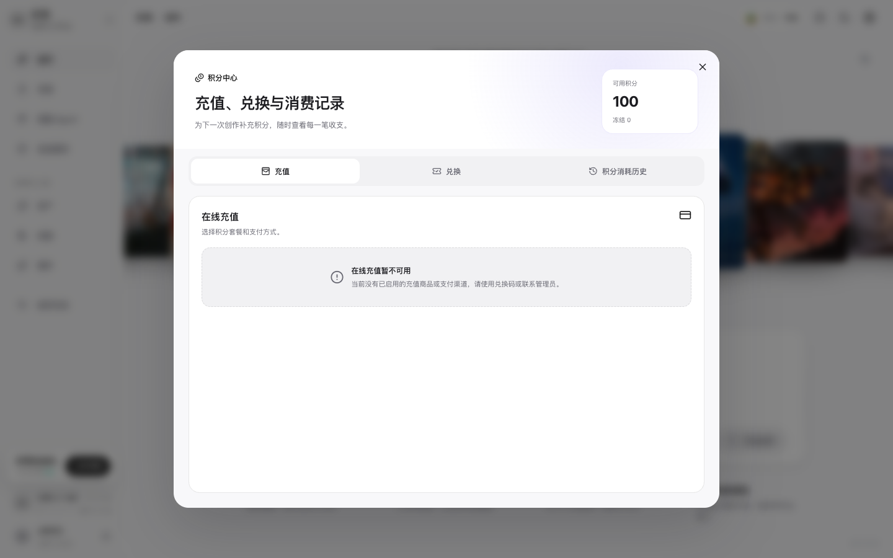
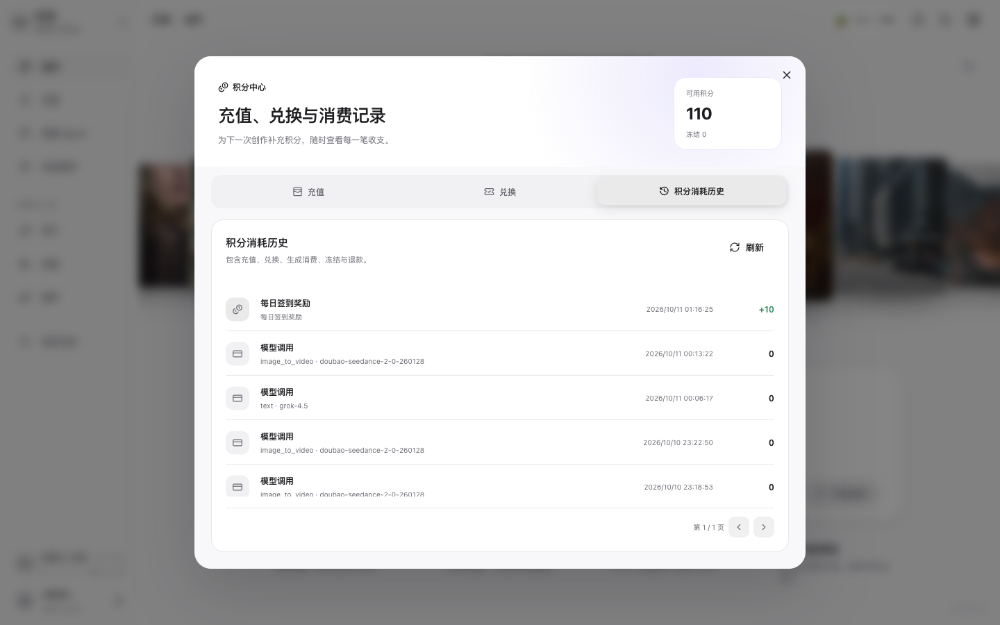

# 查看积分和消费记录

## 适用角色
所有需要确认生成额度的创作者。

## 目标
领取每日奖励，查看充值、兑换、模型调用、冻结和退款记录。

## 领取每日奖励

1. 在创作台左下角找到 **影策加油站**，点击 **立即领取**。
2. 领取成功后，顶部积分按钮会更新余额。领取操作不会启动生成任务。

## 查看积分中心

1. 点击顶部 **积分** 按钮。

积分中心的 **充值** 标签会显示在线充值是否可用；当前环境若显示“在线充值暂不可用”，请使用 **兑换** 或联系管理员。

2. 点击 **积分消耗历史**，查看每日奖励、模型调用、消费退款和新用户默认积分。
3. 生成任务遇到失败时，先看这里是否出现“消费退款”，再决定是否重试。

## 成功判据
积分余额和消费记录与创作历史中的结算状态一致。
